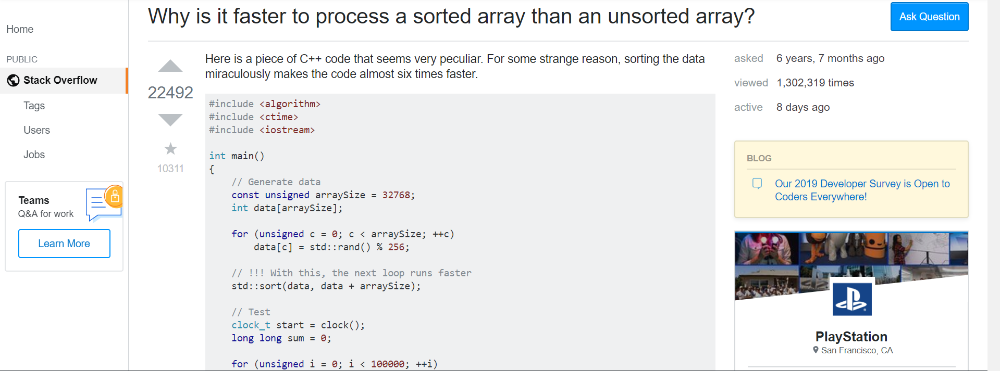

## An (in)effective approach

When I worked as a computer science peer mentor, I answered students’ questions about if they’re on the right track, what the next step should be, and to clarify concepts. The job taught me to effectively communicate with other developers and if I had a question of my own, how to ask my professor in a mostly concise way. While many students who came in had good questions (e.g. “I’ve completed X but getting an error with Y. Could Z be causing the problem?”), there were the ones who just didn’t show any care and their questions proved it. The most inept and annoying question that I’ve come across is, “What do I do?”. They would just open their laptop, turn the screen toward me, and look expectedly until I started talking. This would then be followed up with “How do I do that?”. Needless to say, these useless queries have made me seriously reconsider the phrase “There’s no such thing as a stupid question”. 

## Like this one

[Link to the post](https://stackoverflow.com/questions/54339219/identify-java-classes-from-these-logs)

This user didn’t post any code to review, just the server logs and a demand to get help to identify the Java classes used in them. The title “Identify java classes from these logs?” barely explains what they’re looking for since classes are so varied and broad. Part of the user’s post even states, “I am just guessing, I do not know if these are considered classes of the java program.”, which begs the question as to why they even asked in the first place. The top answer to the post begins by saying, “How are we supposed to know that? We have zero context of what you are talking about!”. Such an unnecessary, unconcise question deserves an such an unsurprising answer. 

## In contrast… 

[Link to the post](https://stackoverflow.com/questions/11227809/why-is-it-faster-to-process-a-sorted-array-than-an-unsorted-array)

Here is a much better one! The user asked a clear, concise question and posted their source code in both C++ and Java. Additionally, the user posted the processing times for unsorted and sorted arrays in both languages to show that they’d checked if this was mutually exclusive phenomenon. The top answer to this post answers the question in an in-depth way, giving multiple examples and analogies to help the original poster to understand. This answer reflects the quality of the question, which can also be said for the previous question and answer. I hope that these questions can serve as examples to others that they’ll get an answer with the same amount of effort as their question. 
