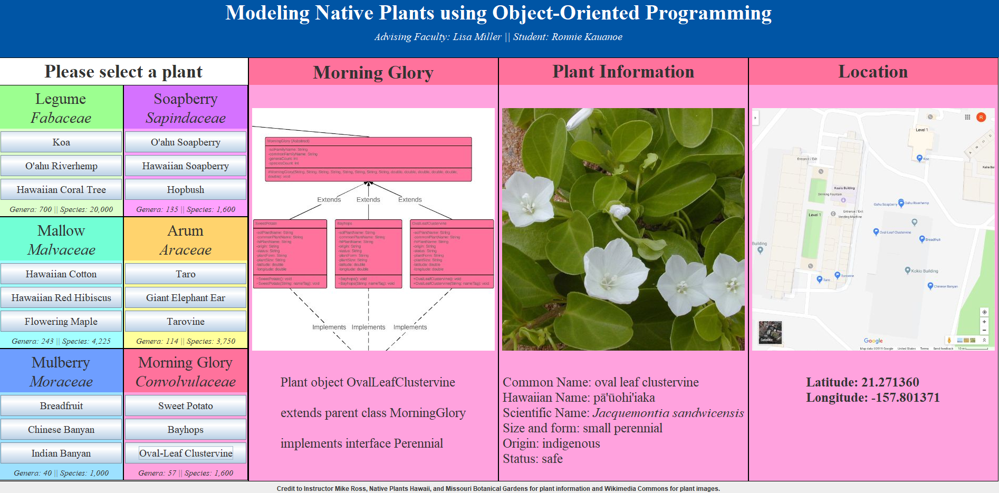

This project was made for my STEM Research Experience in Computer Science (SCI 295CS) course taught by Professor Lisa Miller at Kapiolani Community College in Spring 2019. The project's goal was to model native Hawaiian plants as Java classes and create a graphical user interface (GUI) to display at the end of the semester. The GUI contains four columns. The first contains six "card" that hold a families' plant buttons. The second is an image of the corresponding family class and plant classes taken from the UML diagram. The third displays an image of the plant and its general information. The fourth shows an image of the plants location on campus and its coordinates if it is found there.

As stated previously, I completed the project under Professor Lisa Miller who advised me on how to design the Java classes and the resulting class hierarchy. Additionally, I worked with Professor Mike Ross, a botany professor at Kapiolani Community College, who provided data for the six plant families, their plants, and his expertise in the field. Regarding the development of the classes, I wrote all the code for this project based on the UML diagram developed with Ms. Miller. From this project, I learned how to create a semester-long itinerary and how to model abstract concepts into objects, which included finding common factors between the objects and how to make a superclass broad enough to include every child but narrow enough in scope to only apply to those concepts. This project also taught me how to better manage my time on self-driven projects and being more proactice in communication and acquiring information. 

Click here to view the [project's source code](https://github.com/ronnie-kauanoe/plant-hierarchy). The repository also includes a detailed explanation of the data gathered, how it was utilized, and the development process.
