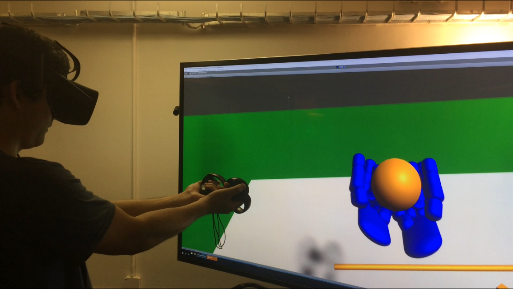

This realistic grasping method was made in Unity using C# and was my research project for the Summer 2018 Hoomanalowai Sophomore Success Summer Bridge Program. The goal of the project was to create a method using the Oculus Rift that allowed the user to pick up and interact with objects without anchoring them to the user’s controllers, which is the conventional way to “grab” objects in virtual reality. This was achieved by creating 21 spheres (called “nubs”) in Unity for each reference point for one hand model for a total of 42 nubs.  Then, I created a script in C# that made a nub move towards the coordinate of its respective reference point, which was done every frame to emulate smooth movement. The script took in every nub, placed them into an array, and performed this movement on each nub in order. 

I spent 10 weeks developing this method using the resources in the Laboratory for Advanced Visualization and Applications (LAVA) at the University of Hawaii at Manoa. My research faculty and director of LAVA, Dr. Jason Leigh, had given me the problem of unrealistic interactions in virtual reality as my research topic. This research was an individual project but I received assistance from those working in the lab and Dr. Leigh. As part of the summer bridge program, I gave a presentation about my research at the end of the summer at UH Manoa. I presented on the problem that needed to be addressed, the proposed solution, difficulties creating the solution, and possible future applications of this method. 

From this project, I learned how to come up with multiple possible solutions to a problem and to remain resilient when bugs occurred. Additionally, I gained experience on how to develop simulations in Unity using the Oculus SDK and C#. Also, I gained experience on how to present my findings in a clear manner that allowed those inside of and outside of computer science to understand the project. Being able to perform independent research was another important lesson as there weren’t any other students from the summer bridge program placed into LAVA.

Click here for the recording of my [final presentation](https://www.youtube.com/watch?v=ekSkhmUiDcE).
