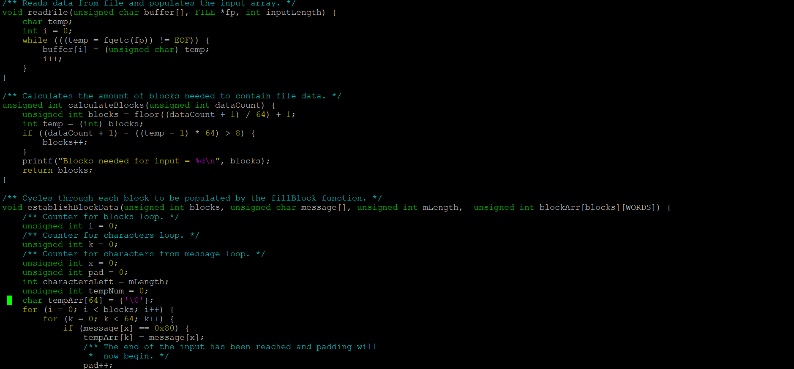

This version of SHA-1 was programmed in C on UHUnix and was the final project for my ICS 212 class. SHA-1 is a cryptographic hashing algorithm that takes in a string of characters as input and separates it into 32-bit unsigned integers (called “words”). These words are followed by the EOF character and put into arrays (called “blocks”) of size 16. The blocks are padded with zeroes to fill any remaining indices and the last word of the last block is reserved for the length of the input. The number of blocks is determined by the size of the input with the end of file character. Then, the elements of each block are put into arrays of size 80 to be hashed using helper functions that are dependent on the location of the element currently being looked at in the array. By the end of this process, a five-word message digest is produced in hexadecimal. 

This was an individual project and while I did collaborate with other students, each of us needed to turn in our own version. The primary language we covered during the semester was C with an overview of C++ in the last two weeks. Creating the program was great practice in reading pseudocode, using all the functions we had learned in the semester, and how to use visuals to gain a deeper understanding of code. The most interesting part of this assignment was creating an algorithm that has a tangible, real-world application, even though it’s one of the oldest iterations of secure hashing algorithms. I may not be in cybersecurity but working on SHA-1 has given me a better appreciation for encryption and how it’s done. 

Click here to view the [source code](https://github.com/ronnie-kauanoe/sha1-final-project/tree/master).

Click here to learn more about the [Secure Hash Standard](https://web.archive.org/web/20161126003357/http://nvlpubs.nist.gov/nistpubs/FIPS/NIST.FIPS.180-4.pdf).
