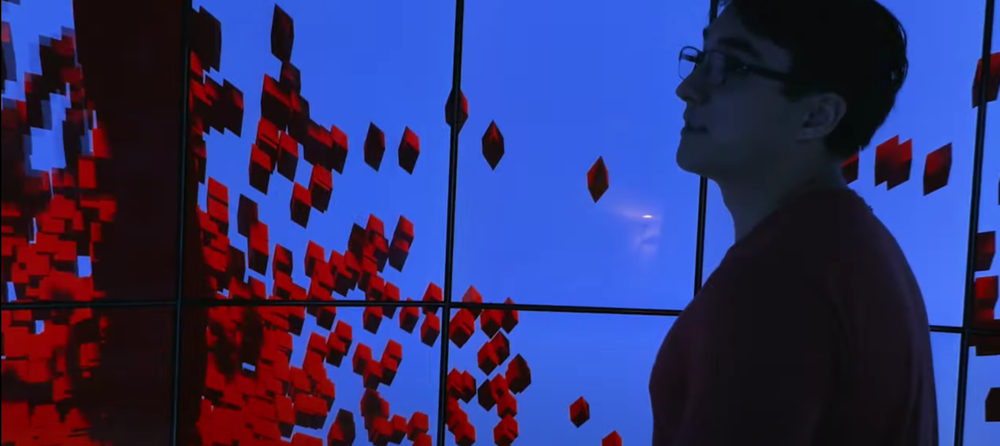

The Cyber-enabled Analysis, Navigation, and Observation Environment (CyberCANOE) is a hybrid reality environment developed by Dr. Jason Leigh in the Laboratory for Advanced Visualization and Applications (LAVA) at the University of Hawaii at Manoa. When I joined LAVA, my first project was to collaborate with Dr. Leigh and integrate Vive tracking into the Destiny-Class CyberCANOE housed in the lab by modifying the existing Unity package and installing new hardware. First, I exposed the data from a Vive Tracker and two Vive Pro controllers using a modified Virtual Reality Peripheral Network (VRPN). Second, I used Unity's ClusterInput classes to retrieve the exposed data and mapped the position and rotation data to the tracker (head and camera tracking) and controllers (left/right hands) along with the controller input. During development, the lab replaced Destiny's eight computer nodes. One of the nodes is assigned as the master node and distributes data to its seven subordinates. This allows the view and controller input to be synchronized across all eight nodes. I participated in the physical replacement of the computer nodes and configuring the nodes' settings for use in Destiny. Once this process was complete, I installed two Vive lighthouses into Destiny and created a basic application to test the updated Unity package. Several months after the completion of the Destiny implementation, I repeated the process with the Innovator-Class CyberCANOE, which is also housed in the lab. 

The development, implementation, and testing of the Destiny portion of the Unity package took eight months to complete. It took a month to do the same for the Innovator portion due to the system using only one computer and the fundamental similarities between the systems. I am now responsible for maintaining and troubleshooting the Destiny-class and Innovator-class CyberCANOEs and develop and assist with the creation of new hybrid reality applications in Unity3D. During this project, I learned how to integrate multiple complex software systems into one product. Additionally, I gained more experience on working with hardware as I had not had much experience before this project. Finally, I learned how to work in a professional settings and how to refine the questions I asked to streamline my development. 

Click here to view the [CyberCANOE wiki](https://github.com/uhmlavalab/CyberCANOE/wiki).

Click here to view the [LAVA homepage](https://www.lavaflow.info/).

Click here to view the [modified VRPN](https://gitlab.com/karlun/vrpn-openvr) developed by Dr. Karljohan Palmerius.
